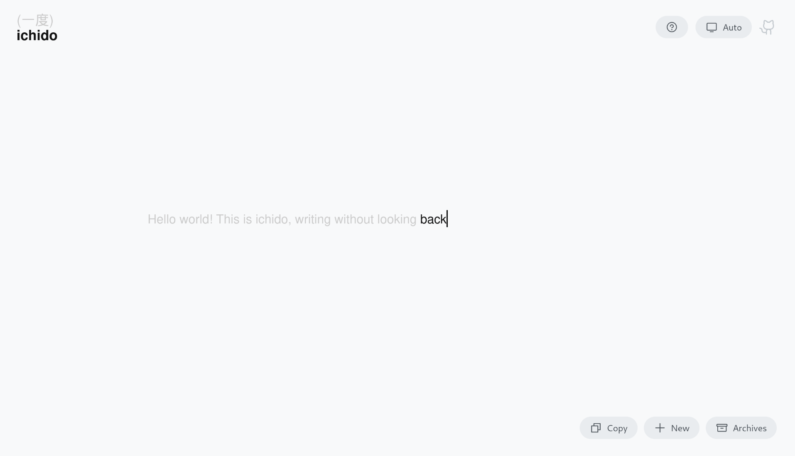

# ichido (一度)

**A minimalist space for honest reflection.**

Write what matters. Once. Without revision.



## Philosophy

**ichido** (一度, "once" or "one time") embodies a simple truth: authentic expression comes before perfect editing.

The interface enforces forward-only writing. Once you complete a word (spacebar), it becomes immutable. This constraint creates space for:

- **Honest intention setting** without self-censorship
- **Gratitude practice** that captures first impressions
- **Reflective dialogue** with what you hold sacred (universe, future self, loved ones, the divine)

No affiliation required. No beliefs enforced. Just presence and attention.

---

## Core Principles

1. **Presence over Perfection** - The inability to edit keeps you in the present moment
2. **Simplicity as Feature** - Zero configuration, zero distractions, zero data tracking
3. **Privacy by Design** - Everything stays in your browser's local storage
4. **Zero Runtime Dependencies** - Vanilla TypeScript, no framework bloat

---

## Quick Start

```bash
# Install dependencies
npm install

# Start development server
npm run dev

# Build for production
npm run build
```

---

## Development

### Tech Stack

- **TypeScript** - Strict mode, no compromises
- **Vite** - Build tool and dev server
- **Vitest** - Unit testing
- **Playwright** - E2E testing (cross-browser)

### Project Structure

```
src/
├── main.ts              # Entry point
├── app.ts               # Application orchestration
├── types.ts             # TypeScript interfaces
├── config.ts            # Constants
├── icons.ts             # SVG definitions
├── modules/
│   ├── state.ts         # localStorage operations
│   ├── editor.ts        # Editor logic and rendering
│   ├── ui.ts            # UI components and themes
│   └── prompts.ts       # Guided mode system
└── styles/
    └── main.css         # All styling
```

### Testing

```bash
# Unit tests
npm test                 # Run once
npm run test:ui          # Interactive UI
npm run test:coverage    # Coverage report

# E2E tests (Playwright)
npm run test:e2e         # Headless
npm run test:e2e:ui      # Interactive
```

---

## Contributing

See [CONTRIBUTING.md](./docs/CONTRIBUTING.md) for guidelines.

Key areas for contribution:

- **Accessibility improvements** - Screen reader support, keyboard navigation
- **Internationalization** - Translations for UI and guided prompts
- **Mobile optimization** - Touch interactions, responsive design
- **Optional features** - Export formats, encryption, sync (as opt-in plugins)

---

## Privacy & Data

**What we collect:** Nothing.

**Where your data lives:** Your browser's localStorage only.

**How to export:** Use the "Copy" button on any reflection in Archives.

**How to delete:** Click "Delete" on individual reflections, or clear browser data.

---

## Roadmap

**Current:** v1.0 - Core experience with modular architecture

**Exploring:**

- Mobile app (PWA first, native later)
- Optional end-to-end encrypted sync
- Plugin system for custom prompts
- Export to PDF/Markdown
- Accessibility audit and improvements

We ship slowly. Every feature must justify its complexity cost.

---

## Philosophy Deep Dive

Read [PHILOSOPHY.md](./docs/PHILOSOPHY.md) for the full design reasoning.

**TLDR:** This app believes:

1. Authentic expression > polished performance
2. Constraints enable creativity
3. Privacy is not negotiable
4. Simplicity serves everyone

---

## Support

- **Questions:** [Open a Discussion](https://github.com/leekaize/ichido/discussions)
- **Bugs:** [File an Issue](https://github.com/leekaize/ichido/issues)
- **Donations:** [](https://ko-fi.com/P5P01KE5GQ)

---

## License

MIT License - see [LICENSE](./LICENSE) for details.

Built by [Lee Kai Ze](https://github.com/leekaize) with the belief that honest reflection should be accessible to everyone.
